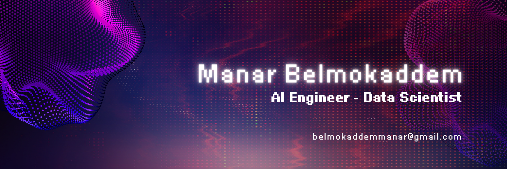

  

<h1 align="center">Hi, I'm Manar Belmokaddem 👩🏻‍💻</h1>

  <i>Data Scientist & AI Engineer — passionate about Generative AI, LLMs, and intelligent products.</i>

  
  

---

## 🧠 About
- Building with **LLMs**, **RAG**, and **Computer Vision** to turn data into smart, usable experiences.
- Currently on a Master's of Data science in **Paris Saclay University**
- Engineering background: **ENSEIRB-MATMECA** (Telecom & AI) · **INPT Rabat** (Smart ICT).  
- Curious, product-minded, and obsessed with **reliable, scalable AI pipelines**.

---

## 🛠️ Tech Stack

### 📄 Programming

---

### 🤖 AI & Machine Learning

---

### 💾 Data & Databases

---

### ⚙️ Tools & DevOps

---

## 🔬 Featured Projects
- **INPT-GPT Chatbot** — RAG + LLM (LangChain, ChromaDB, Streamlit) answering questions about INPT programs.  
- **Vehicle Detection** — Real-time highway analytics with **YOLOv8** + **OpenCV** (detection, classes, counting).  

---

⭐️ *Thanks for visiting!*
